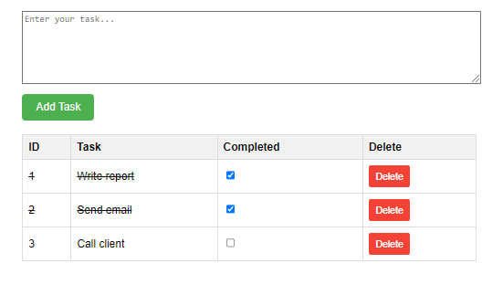

## Task Manager Web Application

This is a simple Task Manager web application built using HTML, CSS, and JavaScript. The application allows users to add, delete, and mark tasks as completed. It dynamically updates the task list interface without needing to reload the page. The tasks are stored in memory within the JavaScript code, making it suitable for small-scale task management purposes. Feel free to use, modify, and expand upon this code for your own projects!

---

